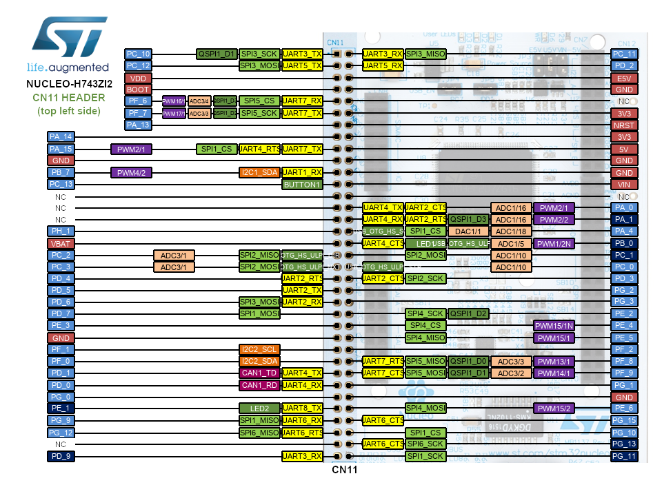
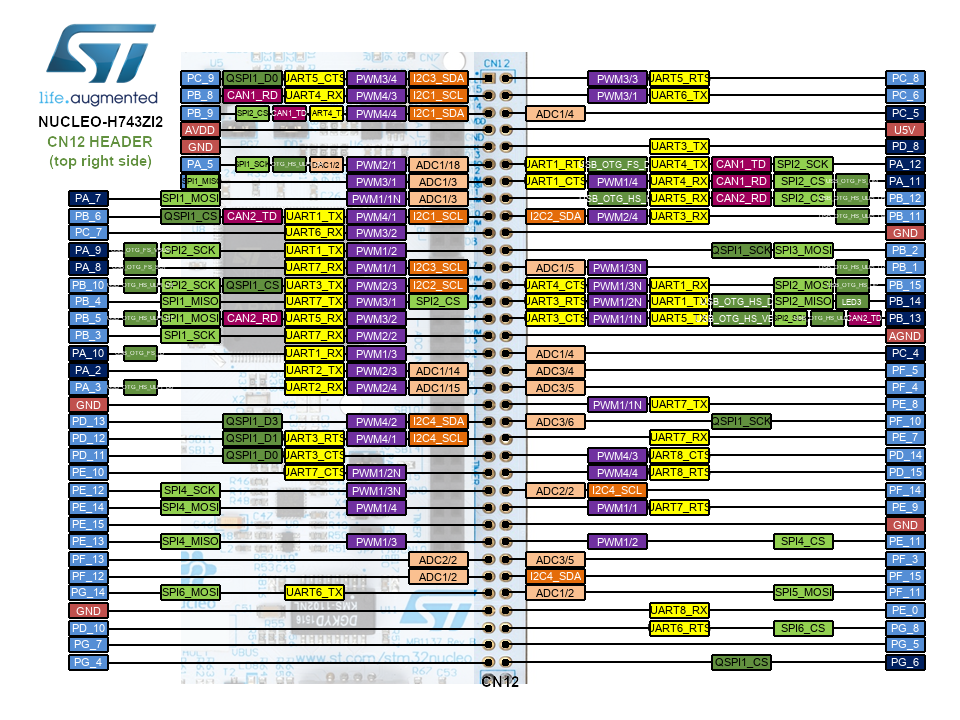

# STMicroelectronics NUCLEO-H743ZI

## Overview

The STM32 Nucleo-144 board provides an affordable and flexible way for users to try out new concepts and build prototypes by choosing from the various combinations of performance and power consumption features, provided by the STM32 microcontroller. For the compatible boards, the internal or external SMPS significantly reduces power consumption in Run mode. The ST Zio connector, which extends the ARDUINO® Uno V3 connectivity, and the ST morpho headers provide an easy means of expanding the functionality of the Nucleo open development platform with a wide choice of specialized shields.

The STM32 Nucleo-144 board does not require any separate probe as it integrates the ST-LINK debugger/programmer.

The STM32 Nucleo-144 board comes with the STM32 comprehensive free software libraries and examples available with the STM32Cube MCU Package.

## Board pinout

### Zio and Arduino-compatible headers

### CN11 CN12 headers

## Schematics

- [NUCLEO-H743ZI board schematic](https://www.st.com/resource/en/schematic_pack/mb1364-h743zi-c01_schematic.pdf)

## CMSIS-Drivers

This board support pack contains a CMSIS-Driver for the [VIO](https://arm-software.github.io/CMSIS_5/develop/Driver/html/group__vio__interface__gr.html) interface. This is a virtual I/O abstraction for peripherals that are typically used in example projects. The **Blinky** example uses this interface to create a blinking light with the USER LED mounted on the board that can be controlled by the **Button USER**.

Virtual Resource  | Variable       | Physical Resource on NUCLEO-H743ZI             |
:-----------------|:---------------|:-----------------------------------------------|
vioBUTTON0        | vioSignalIn.0  | GPIO C.13: Button USER                         |
vioLED0           | vioSignalOut.0 | GPIO B.14: LD3 RED                             |
vioLED1           | vioSignalOut.1 | GPIO B.0:  LD1 GREEN                           |
vioLED2           | vioSignalOut.2 | GPIO E.1:  LD2 YELLOW                          |

Refer to the [schematics](#schematics) for board connection information.

## ST-LINK driver installation and firmware upgrade

1. Download the latest [ST-LINK driver](https://www.st.com/en/development-tools/stsw-link009.html) (Windows only).
2. Extract the archive and run `dpinst_amd64.exe`. Follow the displayed instructions.
3. Download the latest [ST-LINK firmware upgrade](https://www.st.com/en/development-tools/stsw-link007.html) (Linux/Mac OS/Windows).
4. Extract the archive and run the STLinkUpgrade application.
5. Connect the board to your PC using a USB cable and wait until the USB enumeration is completed.
6. In the **ST-Link Upgrade** program, press the **Device Connect** button.
7. The current ST-LINK version should be displayed.
8. Press the **Yes >>>>** button to start the firmware upgrade process.